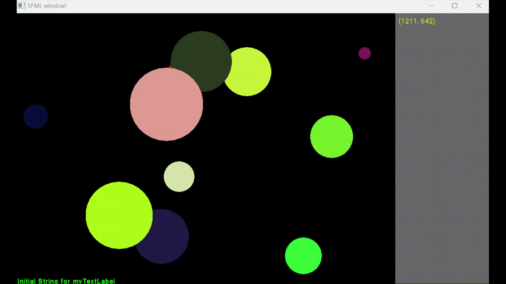

# Work Report

## Name: <ins> your name goes here </ins>

## Features:

- Not Implemented:
  - what features have been implemented

  

- Implemented:
  - what has been implemented

  

- Partly implemented:
  - what features have not been implemented

  

- Bugs
  - Known bugs

  

# Reflections:

- Any thoughts you may have and would like to share.

# **output**

  

# basic_test.cpp output:
<pre>
    
</pre>
# testB.cpp output:
<pre>
    
</pre>

